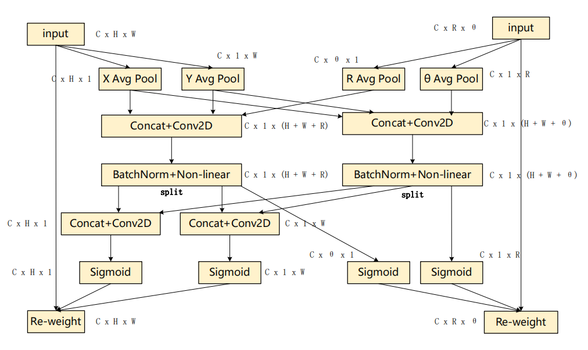
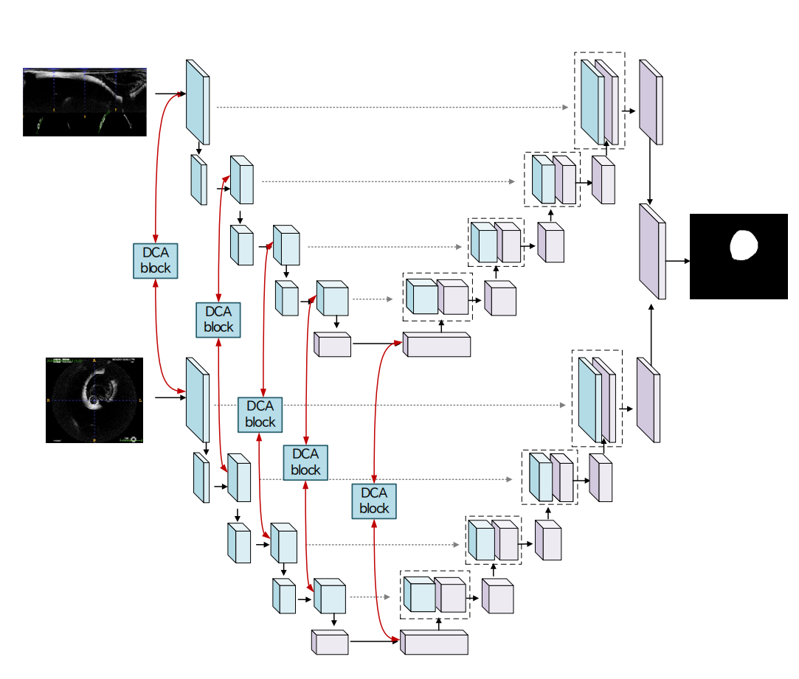

# DCA-UNet: Dual Coordinate Attention Network

[](https://arxiv.org/abs/2405.18731) [](https://www.google.com/search?q=https://github.com/Glaz-j/DCA-Net)
[](https://pytorch.org/)

This repository provides the official PyTorch implementation for the paper: **"Dual Coordinate Attention (DCA) Network for Accurate Cerebral Vascular Endothelium Segmentation in OCT Images"**.

## 目录

  - [项目概览](https://www.google.com/search?q=%23%E9%A1%B9%E7%9B%AE%E6%A6%82%E8%A7%88)
  - [模型架构](https://www.google.com/search?q=%23%E6%A8%A1%E5%9E%8B%E6%9E%B6%E6%9E%84)
  - [主要特性](https://www.google.com/search?q=%23%E4%B8%BB%E8%A6%81%E7%89%B9%E6%80%A7)
  - [环境配置](https://www.google.com/search?q=%23%E7%8E%AF%E5%A2%83%E9%85%8D%E7%BD%AE)
  - [数据集准备](https://www.google.com/search?q=%23%E6%95%B0%E6%8D%AE%E9%9B%86%E5%87%86%E5%A4%87)
  - [如何使用](https://www.google.com/search?q=%23%E5%A6%82%E4%BD%95%E4%BD%BF%E7%94%A8)
  - [实验结果](https://www.google.com/search?q=%23%E5%AE%9E%E9%AA%8C%E7%BB%93%E6%9E%9C)
  - [引用](https://www.google.com/search?q=%23%E5%BC%95%E7%94%A8)
  - [致谢](https://www.google.com/search?q=%23%E8%87%B4%E8%B0%A2)

## 项目概览

本项目提出了一种新颖的深度学习框架 **DCA-UNet**，专为光学相干断层扫描（OCT）图像中的脑血管内皮精准分割而设计。

通过独特的 **双坐标注意力（Dual Coordinate Attention, DCA）** 机制，我们的模型能同时从笛卡尔（Cartesian）坐标系和极（Polar）坐标系中捕捉特征。这种设计显著提升了分割性能，尤其对于传统方法难以处理的、细小且低对比度的血管结构，效果尤为突出。

## 模型架构

DCA-UNet 的核心是将我们设计的 DCA 模块集成到一个双路径的 U-Net 架构中。网络将原始图像及其极坐标变换后的版本作为双输入。在编码器的每一层，DCA 模块都会对齐并融合来自两条路径的特征，使模型能够学习到更鲁棒的、同时包含标准模式和径向模式的特征表示。

这种双视图方法有效弥补了单一坐标系在空间感知上的局限性。

| DCA 模块 | DCA-UNet 整体架构 |
| :---: | :---: |
| \ | \ |
| *图1: 双路径坐标注意力 (DCA) 模块* | *图2: DCA 模块在 U-Net 中的集成方式* |

***注意**: 为了显示上面的图片，请在您的仓库根目录下创建一个名为 `assets` 的文件夹，并将图片 `DCA_module.png` 和 `DCA_U-Net.png` 放入其中。*

## 主要特性

  - **双域框架**: 同时处理笛卡尔坐标和极坐标下的图像，以捕捉全面的结构信息。
  - **双坐标注意力 (DCA)**: 一种轻量且高效的注意力机制，跨坐标系融合特征，增强关键的内皮结构并抑制噪声。
  - **性能卓越**: 在一个具有挑战性的、由专家手动标注的脑血管OCT数据集上，其性能超越了U-Net, U-Net++, Attention U-Net等标准模型。
  - **临床潜力**: 为脑血管疾病的评估和监测提供了一个强大、自动化的分析工具。

## 环境配置

1.  **克隆本仓库:**

    ```bash
    git clone https://github.com/Glaz-j/DCA-Net.git
    cd DCA-Net
    ```

2.  **创建并激活虚拟环境** (推荐):

    ```bash
    python -m venv venv
    source venv/bin/activate  # Windows 用户请使用: venv\Scripts\activate
    ```

3.  **安装依赖:**
    项目依赖项已在 `requirements.txt` 中列出，可使用pip一键安装。

    ```bash
    pip install -r requirements.txt
    ```

## 数据集准备

为了使用提供的脚本，您需要将数据集整理成以下目录结构：

```
data/
├── imgs/
│   ├── train_image_001.png
│   └── ...
├── masks/
│   ├── train_image_001.png
│   └── ...
├── val_imgs/
│   ├── val_image_001.png
│   └── ...
└── val_masks/
    ├── val_image_001.png
    └── ...
```

  - 训练脚本 `train.py` 会从 `data/imgs` 和 `data/masks` 中读取训练数据。
  - 验证数据则从 `data/val_imgs` 和 `data/val_masks` 中读取。

## 如何使用

### 训练模型

使用 `train.py` 脚本来训练 `EncoderDoubleCoordAttUNet` 模型。

**训练命令:**

```bash
python train.py [ARGUMENTS]
```

**常用参数:**

  - `--epochs`: 训练的总轮数 (默认: `100`)。
  - `--batch-size`: 每批次输入的图像数量 (默认: `1`)。
  - `--learning-rate`: 学习率 (默认: `1e-5`)。
  - `--amp`: 启用自动混合精度，可加速训练并节省显存。
  - `--load`: 指定一个检查点文件路径以恢复训练 (例如, `checkpoints4/checkpoint_epoch90.pth`)。

**训练示例:**
从零开始训练100轮，批大小为4，并启用混合精度：

```bash
python train.py --epochs 100 --batch-size 4 --amp --learning-rate 1e-5
```

**注意**: 检查点默认保存在 `./checkpoints4/` 目录中。性能最佳的模型将保存为 `best_checkpoint.pth`。

-----

### 模型评估

使用 `testTool.py` 脚本在测试集上评估已训练好的模型。

**\<font color=red\>重要提示\</font\>**: 在运行评估前，您**必须**修改 `testTool.py` 文件中硬编码的模型路径。

打开 `testTool.py` 文件，找到大约在第 218 行的代码：

```python
# 原始代码
snapshot_path = "./checkpoints8/checkpoint_epoch100.pth"

# 将其修改为您训练好的最佳模型的实际路径，例如：
snapshot_path = "./checkpoints4/best_checkpoint.pth"
```

**评估命令:**

```bash
python testTool.py
```

**评估输出:**

  - **量化指标**: Dice, HD95, Precision等指标将打印在控制台，并保存在 `./test_log/` 目录下的日志文件中。
  - **可视化结果**: 模型预测的分割图像将保存在 `./predictions/` 目录中。

## 实验结果

我们的方法展示了SOTA性能，在所有关键评估指标上都显著优于现有的基线模型。

| Method         | Dice    | HD95     | Precision | Sensitivity | IoU     | VS      |
|----------------|---------|----------|-----------|-------------|---------|---------|
| U-Net          | 0.7701  | 10.4035  | 0.8196    | 0.7483      | 0.6869  | 0.8158  |
| U-Net++        | 0.8305  | 11.4765  | 0.9548    | 0.7980      | 0.7582  | 0.8497  |
| Attention UNet | 0.8044  | 12.9114  | 0.9085    | 0.7883      | 0.7375  | 0.8305  |
| **Ours (DCA-UNet)** | **0.8707** | **6.6880** | **0.8698** | **0.9053** | **0.7844** | **0.9025** |
[cite\_start]*(Results from Table 1 in the paper) [cite: 141]*

## 引用

如果您的研究使用了本仓库的代码或我们论文中的思想，请引用我们的工作：

```bibtex
@article{wu2025dca,
  title={Dual Coordinate Attention (DCA) Network for Accurate Cerebral Vascular Endothelium Segmentation in OCT Images},
  author={Wu, Zhaoye and Shen, Yue and Ng, Eddie Yin Kwee and Huang, Chenxi and Lan, Quan and Ren, Lijie and Li, Jun},
  journal={Springer Nature},
  year={2025}
}
```

## 致谢

[cite\_start]This work was supported by the Open Research Fund(SCRCND202508) of the Shenzhen Clinical Research Center for Neurological Diseases(LCYSSQ20220823091204009). [cite: 169]